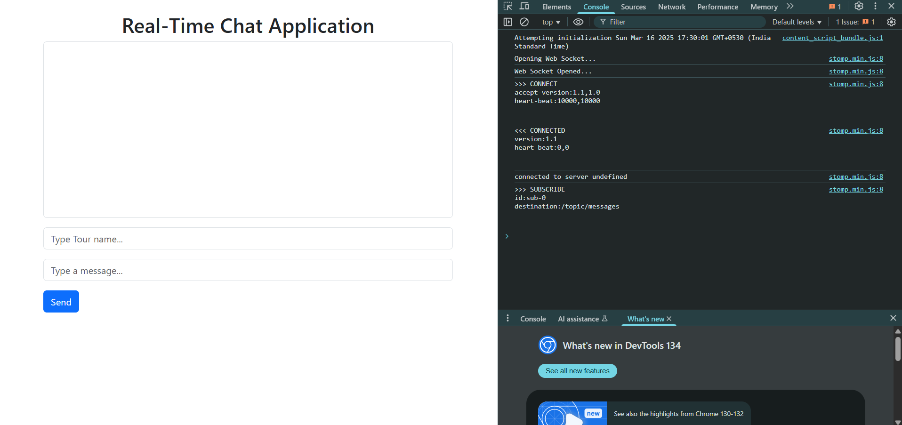
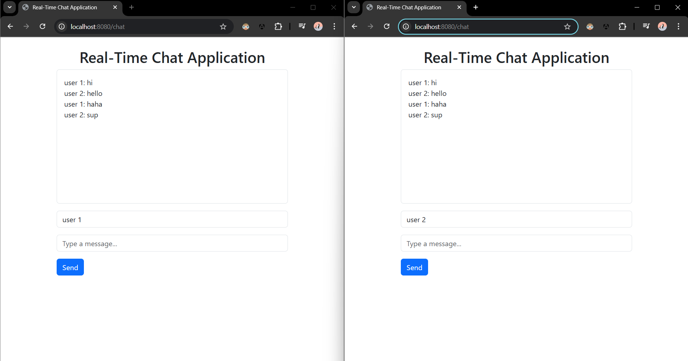

# Real-Time Chat Application

A real-time chat application built with Spring Boot and WebSockets that allows users to send and receive messages instantly.

## Features

- Real-time messaging using WebSockets
- Simple and intuitive UI
- User identification with custom names
- Automatic scrolling to latest messages

## Screenshots


*The main chat interface where users can send and receive messages*


*Example of an active conversation between users*

## Technology Stack

- **Backend**:
  - Java 17
  - Spring Boot 3.4.3
  - Spring WebSocket
  - STOMP (Simple Text Oriented Messaging Protocol)
  
- **Frontend**:
  - HTML/CSS/JavaScript
  - Bootstrap 5.3.3
  - SockJS
  - StompJS

## Getting Started

### Prerequisites

- Java 17 or higher
- Gradle

### Installation

1. Clone the repository
   ```bash
   git clone <your-repo-url>
   cd app
   ```

2. Build the project
   ```bash
   ./gradlew build
   ```

3. Run the application
   ```bash
   ./gradlew bootRun
   ```

4. Access the application at: `http://localhost:8080/chat`

## Usage

1. Open the chat application in your browser
2. Enter your name in the top input field
3. Type your message in the second input field
4. Click "Send" to broadcast your message to all connected users
5. All messages will appear in the chat box in real-time

## Project Structure

```
app/
├── src/
│   ├── main/
│   │   ├── java/
│   │   │   └── com/chat/app/
│   │   │       ├── config/            # WebSocket configuration
│   │   │       ├── controller/        # Web controllers
│   │   │       ├── model/             # Data models
│   │   │       └── AppApplication.java # Main Spring Boot application
│   │   └── resources/
│   │       ├── templates/             # HTML templates
│   │       └── application.properties # Application configuration
│   └── test/                          # Test classes
└── build.gradle                       # Gradle build configuration
```

## License


